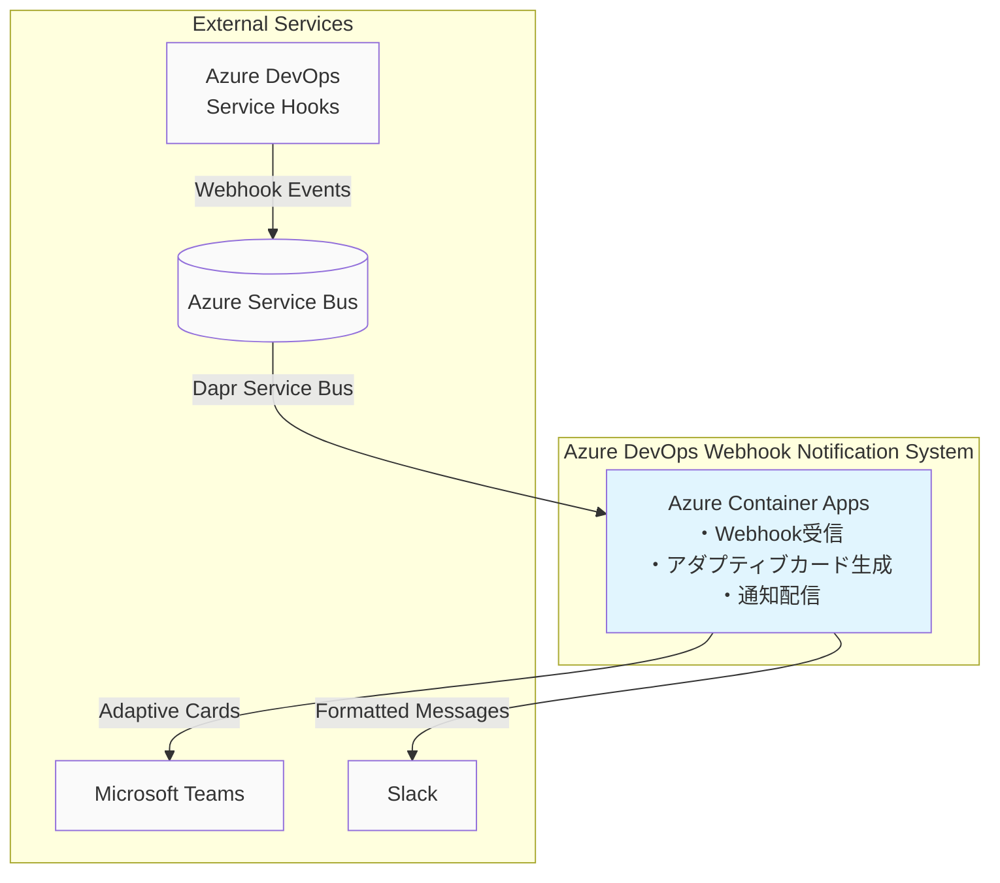
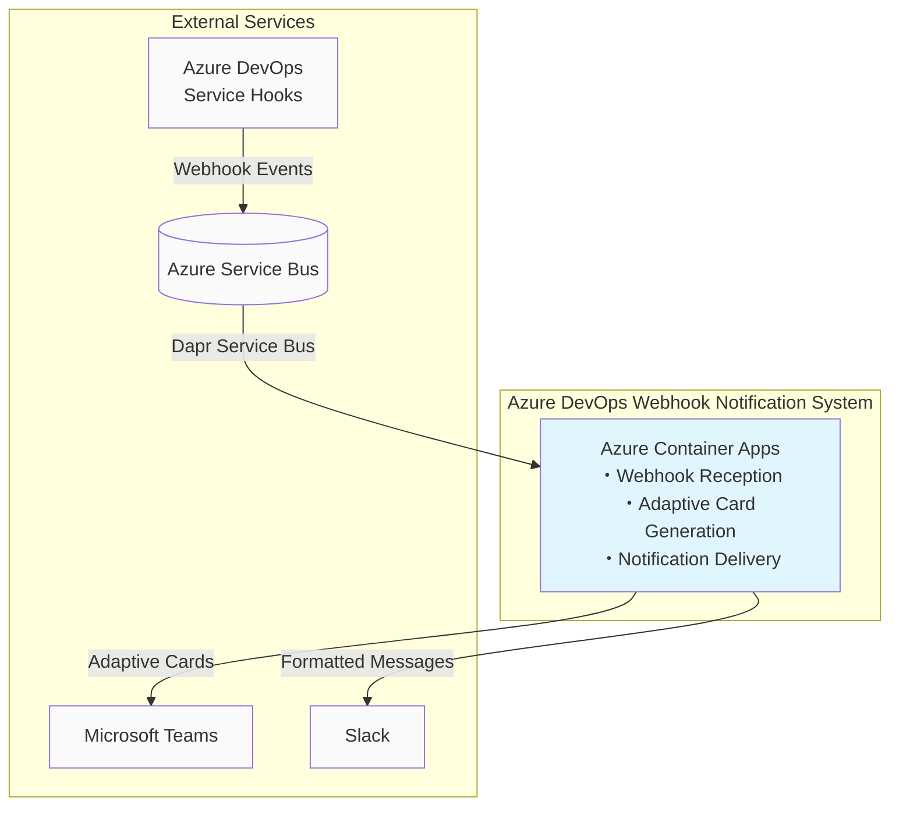

English version is below.

# azdo-ticket-management

Azure DevOpsのイベント通知をリアルタイムでTeamsやSlackに配信するWebhookソリューションです。Azure DevOps Service Hooksを活用し、Azure Service BusとDaprを通じてアダプティブカード形式で通知を行います。

## アーキテクチャ概要

本ソリューションは単一のイベント駆動型システムとして構成されています：

## 主要機能

### リアルタイム通知システム
Azure DevOps Service Hooksからのイベントを受信し、リアルタイムで通知を配信します。

**主要機能：**
- [Azure DevOps Service Hooks](https://docs.microsoft.com/en-us/azure/devops/service-hooks/)からのWebhookイベント受信
- Azure Service Busを通じた非同期メッセージ処理
- Dapr Service Bus統合による分散メッセージング
- アダプティブカード形式でのTeams通知
- Slack向けフォーマット済みメッセージ配信

**対応イベント：**
- Work Item作成・更新・削除
- Pull Request作成・完了・承認
- Build完了・失敗
- Release デプロイ
- Code Push
- その他Azure DevOpsイベント

**通知形式：**
- **Microsoft Teams**: アダプティブカード形式
- **Slack**: リッチフォーマットメッセージ
- イベント種別に応じたカスタマイズされた表示

## 技術スタック

### バックエンド
- **.NET 8.0** - メインフレームワーク
- **Dapr** - 分散アプリケーション管理・Service Bus統合
- **Azure Service Bus** - メッセージキューイング
- **Azure Container Apps** - ホスティング環境
- **Azure Key Vault** - シークレット管理

### 通知・連携
- **Microsoft Teams Adaptive Cards** - Teams通知フォーマット
- **Slack API** - Slack通知配信
- **Azure DevOps Service Hooks** - Webhookイベント送信

### インフラストラクチャ
- **Azure Bicep** - Infrastructure as Code
- **Docker** - コンテナ化
- **GitHub Actions** - CI/CD パイプライン

## セットアップ手順

### 前提条件
- 有効なAzureサブスクリプション
- Azure DevOps Services アクセス権限
- Microsoft Teams または Slack ワークスペース
- Docker Desktop
- Azure CLI
- PowerShell 7

### 1. Azure リソース構成

Azure Service BusとContainer Appsの構成については、[setup/azure-resources.md](setup/azure-resources.md)を参照してください。

### 2. Azure DevOps Service Hooks設定

Service Hooksの設定については、[setup/service-hooks.md](setup/service-hooks.md)を参照してください。

### 3. Teams/Slack 連携設定

通知先の設定については、[setup/notifications.md](setup/notifications.md)を参照してください。

### 4. アプリケーションデプロイ

Container Appsへのデプロイについては、[setup/deployment.md](setup/deployment.md)を参照してください。

## 使用方法

### 1. Service Hooks設定
Azure DevOpsプロジェクトでService Hooksを設定し、Azure Service Busにイベントを送信するよう構成します。

### 2. 通知確認
設定したイベントが発生すると、自動的にTeamsやSlackに通知が配信されます。

### 3. 通知カスタマイズ
イベント種別や重要度に応じて通知形式をカスタマイズできます。

## サポートされるイベント

### Work Items
- Work Item作成
- Work Item更新（ステータス変更、アサイン変更等）
- Work Item削除

### Pull Requests
- Pull Request作成
- Pull Request完了
- Pull Request承認・拒否
- レビューコメント追加

### Build & Release
- Build完了（成功・失敗）
- Release デプロイ（成功・失敗）
- Stage承認要求

### Repository
- Code Push
- Branch作成・削除
- Tag作成

## 監視・アラート

### Azure Monitor統合
- Container Apps メトリクス監視
- Service Bus キューメトリクス
- アプリケーションログ集約

### 通知配信状況
- 配信成功/失敗の追跡
- 再試行メカニズム
- エラーログ出力

## トラブルシューティング

### よくある問題
1. **通知が届かない**: Service Hooks設定とService Bus接続を確認
2. **アダプティブカードが表示されない**: Teams権限設定を確認
3. **メッセージ重複**: Service Bus重複検出設定を確認

詳細は[troubleshooting.md](docs/troubleshooting.md)を参照してください。

## ライセンス

本プロジェクトはMITライセンスの下で公開されています。

## 貢献

プルリクエストやイシューの報告を歓迎します。開発に参加される場合は、以下のガイドラインに従ってください：

1. このリポジトリをフォーク
2. フィーチャーブランチを作成
3. 変更をコミット
4. プルリクエストを作成

## サポート

- **技術的な問題**: GitHubのIssuesでお知らせください
- **機能要望**: Discussionsでご提案ください
- **緊急の問題**: Issue タイトルに"CRITICAL"を含めてください

## 関連リンク

- [Azure DevOps Service Hooks Documentation](https://docs.microsoft.com/en-us/azure/devops/service-hooks/)
- [Azure Service Bus Documentation](https://docs.microsoft.com/en-us/azure/service-bus-messaging/)
- [Azure Container Apps Documentation](https://docs.microsoft.com/en-us/azure/container-apps/)
- [Dapr Service Bus Documentation](https://docs.dapr.io/reference/components-reference/supported-pubsub/setup-azure-servicebus/)
- [Microsoft Teams Adaptive Cards](https://docs.microsoft.com/en-us/adaptive-cards/)

---

# Azure DevOps Webhook Notification System

A real-time webhook solution that delivers Azure DevOps event notifications to Teams and Slack. This solution leverages Azure DevOps Service Hooks and delivers notifications in Adaptive Card format through Azure Service Bus and Dapr.

## Architecture Overview

This solution is configured as a single event-driven system:

## Key Features

### Real-time Notification System
Receives events from Azure DevOps Service Hooks and delivers notifications in real-time.

**Key Features:**
- Webhook event reception from [Azure DevOps Service Hooks](https://docs.microsoft.com/en-us/azure/devops/service-hooks/)
- Asynchronous message processing through Azure Service Bus
- Distributed messaging with Dapr Service Bus integration
- Teams notifications in Adaptive Card format
- Formatted message delivery for Slack

**Supported Events:**
- Work Item creation, updates, deletion
- Pull Request creation, completion, approval
- Build completion/failure
- Release deployment
- Code Push
- Other Azure DevOps events

**Notification Formats:**
- **Microsoft Teams**: Adaptive Card format
- **Slack**: Rich format messages
- Customized display based on event types

## Technology Stack

### Backend
- **.NET 8.0** - Main framework
- **Dapr** - Distributed application management & Service Bus integration
- **Azure Service Bus** - Message queuing
- **Azure Container Apps** - Hosting environment
- **Azure Key Vault** - Secret management

### Notifications & Integration
- **Microsoft Teams Adaptive Cards** - Teams notification format
- **Slack API** - Slack notification delivery
- **Azure DevOps Service Hooks** - Webhook event transmission

### Infrastructure
- **Azure Bicep** - Infrastructure as Code
- **Docker** - Containerization
- **GitHub Actions** - CI/CD pipeline

## Setup Instructions

### Prerequisites
- Valid Azure subscription
- Azure DevOps Services access permissions
- Microsoft Teams or Slack workspace
- Docker Desktop
- Azure CLI
- PowerShell 7

### 1. Azure Resource Configuration

For Azure Service Bus and Container Apps configuration, see [setup/azure-resources.md](setup/azure-resources.md).

### 2. Azure DevOps Service Hooks Setup

For Service Hooks configuration, see [setup/service-hooks.md](setup/service-hooks.md).

### 3. Teams/Slack Integration Setup

For notification destination setup, see [setup/notifications.md](setup/notifications.md).

### 4. Application Deployment

For Container Apps deployment, see [setup/deployment.md](setup/deployment.md).

## Usage

### 1. Service Hooks Configuration
Configure Service Hooks in your Azure DevOps project to send events to Azure Service Bus.

### 2. Notification Verification
When configured events occur, notifications are automatically delivered to Teams or Slack.

### 3. Notification Customization
You can customize notification formats based on event types and importance levels.

## Supported Events

### Work Items
- Work Item creation
- Work Item updates (status changes, assignment changes, etc.)
- Work Item deletion

### Pull Requests
- Pull Request creation
- Pull Request completion
- Pull Request approval/rejection
- Review comment addition

### Build & Release
- Build completion (success/failure)
- Release deployment (success/failure)
- Stage approval requests

### Repository
- Code Push
- Branch creation/deletion
- Tag creation

## Monitoring & Alerts

### Azure Monitor Integration
- Container Apps metrics monitoring
- Service Bus queue metrics
- Application log aggregation

### Notification Delivery Status
- Delivery success/failure tracking
- Retry mechanisms
- Error log output

## Troubleshooting

### Common Issues
1. **Notifications not received**: Check Service Hooks configuration and Service Bus connection
2. **Adaptive Cards not displaying**: Check Teams permission settings
3. **Message duplication**: Check Service Bus duplicate detection settings

For details, see [troubleshooting.md](docs/troubleshooting.md).

## License

This project is released under the MIT License.

## Contributing

Pull requests and issue reports are welcome. When participating in development, please follow these guidelines:

1. Fork this repository
2. Create a feature branch
3. Commit your changes
4. Create a pull request

## Support

- **Technical Issues**: Please report via GitHub Issues
- **Feature Requests**: Please suggest via Discussions
- **Critical Issues**: Include "CRITICAL" in the issue title

## Related Links

- [Azure DevOps Service Hooks Documentation](https://docs.microsoft.com/en-us/azure/devops/service-hooks/)
- [Azure Service Bus Documentation](https://docs.microsoft.com/en-us/azure/service-bus-messaging/)
- [Azure Container Apps Documentation](https://docs.microsoft.com/en-us/azure/container-apps/)
- [Dapr Service Bus Documentation](https://docs.dapr.io/reference/components-reference/supported-pubsub/setup-azure-servicebus/)
- [Microsoft Teams Adaptive Cards](https://docs.microsoft.com/en-us/adaptive-cards/)